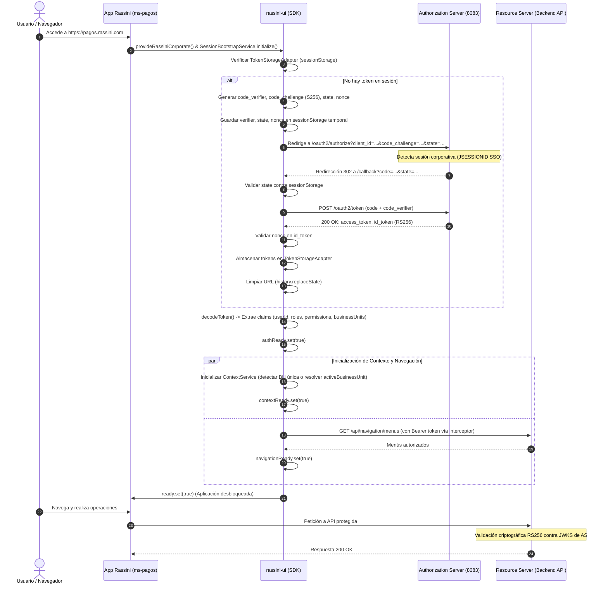

# Especificación Arquitectónica Definitiva: Rassini Corporate SDK (`@rassini/rassini-ui`)

## 1. Resumen Ejecutivo y Correcciones Arquitectónicas

Esta especificación consolida la evolución de `@rassini/rassini-ui` para convertirse en el **SDK corporativo oficial de autenticación, navegación y contexto** para todo el ecosistema Rassini (`ms-pagos`, `Portal RH`, `Portal Compras`, etc.), asegurando **100% de retrocompatibilidad** con las aplicaciones en Fase 1 (`employee-portal-ui`).

### Tabla de Resolución de las 11 Correcciones Mandatarias

| # | Corrección Mandataria | Solución Arquitectónica Implementada | Ubicación en SDK |
|---|----------------------|---------------------------------------|-------------------|
| **1** | **SessionStorage no es almacenamiento seguro** | Reconocimiento explícito de vector XSS según RFC 9700. No se califica como "seguro". Se diseña interfaz abstracta `TokenStorageAdapter` desacoplada para facilitar migración futura a BFF (Backend For Frontend). Recomendaciones estrictas de CSP y URL sanitization. | `TokenStorageAdapter`, `SessionStorageTokenStorageAdapter` |
| **2** | **Desacoplar descubrimiento de configuración de clientes** | OIDC Discovery (`/.well-known/openid-configuration`) resuelve endpoints del AS. La configuración del cliente (`clientId`, `redirectUri`, `allowedApiOrigins`) se resuelve vía `CorporateConfigurationAdapter` (implementaciones: `Static`, `Remote`, `Environment`). | `CorporateConfigurationAdapter` |
| **3** | **Eliminar fallback automático a localStorage** | Modo OIDC opera **únicamente** con el `TokenStorageAdapter` inyectado (por defecto `sessionStorage`). No existe fallback a `localStorage`. El modo `LEGACY` mantiene su compatibilidad aislada. | `SessionStorageTokenStorageAdapter`, `AuthMode` |
| **4** | **Aclarar validación de redirect_uri** | La SPA valida preventivamente que `redirectUri === window.location.origin + '/callback'`. La validación definitiva, autoritativa y estricta la ejecuta el Authorization Server en BD (`oauth_client_redirect_uris`). No se permiten wildcards ni subdominios dinámicos. | `AuthenticationService`, `validateRedirectUri()` |
| **5** | **Decodificación frontend vs Validación backend** | La SPA realiza **únicamente** decodificación sin firma (`jwtDecode`) para UX, signals reactivos, guards de rutas y directivas de templates. El Resource Server (backend de cada microservicio) realiza la **validación criptográfica estricta** (firma RS256 contra JWKS, issuer, aud, exp, nbf, scopes/authorities). Los guards de Angular no sustituyen la seguridad del backend. | `AuthenticationService.decodeToken()`, Resource Server Filter |
| **6** | **Ciclo de vida y resolución de activeBusinessUnit** | Si el usuario tiene 1 BU: se autoselecciona. Si tiene múltiples o `hasAllBusinessUnits=true`: `activeBusinessUnit` inicia en `null` (requiere selección explícita del usuario vía selector UI corporativo, persistida en `sessionStorage` segmentada por `rassini:{applicationCode}:{username}:activeBusinessUnit`). `${BUSINESS_UNIT}` falla de inmediato si `activeBusinessUnit` es `null`. `setActiveBusinessUnit(bu)` valida contra la lista de BUs autorizadas o catálogo general si `hasAllBusinessUnits=true`. | `ContextService`, `AuthenticationService` |
| **7** | **Manejo de estados discretos en SessionBootstrapService** | Señales granulares independientes: `authReady`, `contextReady`, `navigationReady`, `ready`. Señales de error: `authError`, `contextError`, `navigationError`, `bootstrapError`. `navigationReady` **no bloquea** `ready` salvo que la aplicación lo declare obligatorio (`failOnNavigationError: false` por defecto). `initialize()` es idempotente (single-flight Promise/Observable). Fallas en navegación no destruyen la sesión ni provocan loops de login. | `SessionBootstrapService` |
| **8** | **Manejo de nonce y state** | Implementación estricta de PKCE S256 (`code_verifier`, `code_challenge`), `state` aleatorio (32 bytes criptográficos) para mitigar CSRF, y `nonce` (32 bytes criptográficos) incluido en la petición de autorización y verificado contra el claim `nonce` del `id_token`. Consumo único e invalidación/limpieza inmediata de storage y URL (`history.replaceState`). | `AuthenticationService` (PKCE & State/Nonce) |
| **9** | **Decoplamiento de NavigationService** | Se extrae la navegación de `/auth/me` hacia `NavigationAdapter` (`HttpNavigationAdapter`). Expone signals: `menus`, `applications`, `loading`, `loaded`, `error`. El backend devuelve menús ya filtrados y evaluados contra roles/permisos/BUs del usuario. Se exponen helpers de árbol (`filterMenusByPermission`, `findMenuItemByRoute`, `getFlatMenus`). | `NavigationService`, `NavigationAdapter` |
| **10** | **ContextService con modos estricto y tolerante** | Soporta resolución de placeholders `${BUSINESS_UNIT}`, `${BUSINESS_UNITS}`, `${USER_ID}`, `${EMPLOYEE_ID}`, `${USERNAME}`, `${EMAIL}`, `${APPLICATION_CODE}`. Modos: `strict` (lanza `MissingContextPlaceholderError`) y `tolerant` (mantiene o vacía). Codificación obligatoria con `encodeURIComponent` al resolver rutas URL o parámetros query. | `ContextService` |
| **11** | **Interceptors sin bucles y con allowlist de orígenes** | `RassiniTokenInterceptor` verifica contra `allowedApiOrigins` antes de inyectar Bearer token. Cola de reintento single-flight para 401: no dispara múltiples llamadas a `/oauth2/token`. Excluye explícitamente el endpoint de token del AS. En 403 no limpia tokens ni desloguea; redirige a `/access-denied`. En 401 definitivo ejecuta logout limpio sin loops de navegación. | `RassiniTokenInterceptor` |

---

## 2. Matriz Comparativa: Modo LEGACY vs Modo OIDC_CENTRALIZED

| Dimensión | Modo LEGACY (Fase 1 - `employee-portal-ui`) | Modo OIDC_CENTRALIZED (Fase 2+ - `ms-pagos`, Apps Rassini) |
| :--- | :--- | :--- |
| **Flujo de Autenticación** | `POST /auth/login` directo (credenciales contra API). | OAuth 2.1 / OIDC Authorization Code Flow con PKCE S256. |
| **Almacenamiento de Tokens** | `localStorage` (`accessToken`, `refreshToken`). | `TokenStorageAdapter` (`sessionStorageTokenStorageAdapter` tab-scoped). Cero `localStorage`. |
| **Fuente de Identidad** | Monolítica vía respuesta de `/auth/login` o `GET /auth/me`. | **Token-First**: JWT RS256 emitido por el Spring Authorization Server. |
| **Claims Principales** | Parseados del payload JSON del endpoint `/auth/me`. | Extraídos síncronamente del Access Token: `userId`, `employeeId`, `roles`, `permissions`, `businessUnits`, `hasAllBusinessUnits`. |
| **Carga de Navegación** | Acoplada al arranque en `/auth/me`. | **Asíncrona y desacoplada** vía `NavigationService` y `NavigationAdapter`. No bloqueante. |
| **Resolución de Contexto** | Objeto en memoria global. | `ContextService` centralizado con soporte para placeholders y selección explícita de `activeBusinessUnit`. |
| **Guards de Ruta** | `authGuard` básico (comprueba token en `localStorage`), `permissionGuard`. | `RassiniAuthGuard`, `RassiniRoleGuard`, `RassiniPermissionGuard`, `RassiniBusinessUnitGuard` (signals reactivos de `AuthenticationService`). |
| **Directivas Estructurales** | No estandarizadas en templates. | `*rassiniHasRole`, `*rassiniHasPermission`, `*rassiniHasBusinessUnit`, `*rassiniAuthenticated`, `*rassiniAnonymous`. |
| **Intercepción HTTP** | `authInterceptor` básico (reintenta 401 con `refreshToken` directo). | `RassiniTokenInterceptor` con allowlist `allowedApiOrigins`, cola single-flight de refresh, exclusión de AS y manejo no destructivo de 403. |
| **Provider de Configuración** | `provideRassiniAuth(config)` | `provideRassiniCorporate(corporateConfig)` con auto-detección y dual-mode. |

---

## 3. Modelo de Amenazas del Almacenamiento (RFC 9700 & BCP)

Conforme a las recomendaciones del **IETF RFC 9700 (OAuth 2.0 for Browser-Based Applications)**:

1. **Reconocimiento de Riesgo**:
   - `sessionStorage` **NO** es un enclave seguro criptográfico. Los scripts que se ejecutan en el contexto de navegación (incluyendo dependencias de terceros vulneradas o vulnerabilidades de Cross-Site Scripting - XSS) tienen acceso total a `sessionStorage`.
   - La ventaja de `sessionStorage` sobre `localStorage` radica en el **aislamiento por pestaña/sesión**, evitando la persistencia indefinida del token tras el cierre de pestaña y mitigando ataques que explotan persistencia a largo plazo.
2. **Medidas de Mitigación Obligatorias**:
   - **Content Security Policy (CSP)**: `script-src 'self'` estricto, sin `unsafe-inline` ni `unsafe-eval`.
   - **Sanitización de URL**: Consumo inmediato de `code`, `state` y parámetros en la barra de direcciones mediante `window.history.replaceState()`.
   - **No Logging**: Queda terminantemente prohibido imprimir tokens o cabeceras de autorización en `console.log`, logs de cliente o monitores de telemetría.
3. **Evolución hacia BFF**:
   - Se provee la interfaz `TokenStorageAdapter` para que, cuando la infraestructura corporativa despliegue un BFF (Backend For Frontend) con cookies `HttpOnly; Secure; SameSite=Strict`, la capa frontend cambie de adaptador sin alterar una sola línea de lógica en los servicios de negocio de las aplicaciones.

---

## 4. Diagrama de Secuencia: Bootstrap e Integración de Nueva App

